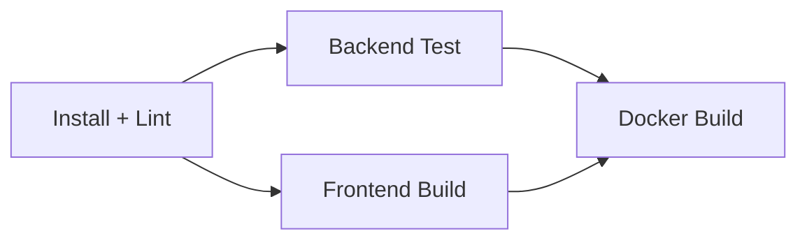

# 工程化升级文档

## 概述

本文档记录了鲜花配送系统的工程化升级内容，包括 Monorepo 改造、代码规范、CI/CD 流水线等。

## 文件变更清单

### 新增文件

| 文件路径 | 用途说明 |
|---------|---------|
| `package.json` | Monorepo 根配置，使用 npm workspaces 管理前后端依赖，提供统一的 lint/test/build 脚本 |
| `eslint.config.mjs` | ESLint 9 Flat Config 共享基础规则，前后端共同继承 |
| `.prettierrc` | Prettier 统一格式化配置（单引号、2空格、尾逗号、行宽100） |
| `.prettierignore` | Prettier 忽略文件配置 |
| `.github/workflows/ci.yml` | GitHub Actions CI 流水线配置 |
| `.husky/pre-commit` | Git pre-commit hook，提交前自动运行 lint-staged |
| `backend/eslint.config.mjs` | 后端 ESLint 配置（CommonJS），继承根目录基础规则 |
| `frontend/eslint.config.mjs` | 前端 ESLint 配置（Vue 3 + ESM），继承根目录基础规则并添加 Vue 插件 |
| `backend/.env.example` | 后端环境变量示例文件，不含真实值 |
| `ENGINEERING.md` | 本文档，记录工程化升级内容 |

### 修改文件

| 文件路径 | 修改内容 |
|---------|---------|
| `backend/package.json` | 添加 `lint`、`lint:fix`、`test` 脚本 |
| `frontend/package.json` | 添加 `lint`、`lint:fix`、`test` 脚本，添加 ESLint Vue 相关依赖 |
| `README.md` | 更新为完整的项目说明文档，包含快速开始、环境配置、常用脚本等 |
| `frontend/vite.config.js` | 修复 ESM 模式下 `__dirname` 未定义问题 |
| `backend/src/app.js` | 修复未使用参数 `next` → `_next` |
| `backend/src/controllers/DeliveryController.js` | 修复未使用变量 `signature` → `_signature` |
| `backend/src/controllers/OrderController.js` | 修复未使用导入 `RoutePlannerService` → `_RoutePlannerService`，未使用参数 `type` → `_type` |
| `frontend/src/components/OrderList.vue` | 移除未使用导入 `computed`，修复 catch 块变量引用 |
| `frontend/src/store/index.js` | 修复 catch 块变量引用，未使用参数 `greetingCard` → `_greetingCard` |
| `frontend/src/views/OrderCreate.vue` | 移除未使用导入 `promotionApi`，修复 template 上无用 class 属性，修复 catch 块变量引用 |
| `frontend/src/views/DeliveryTracking.vue` | 移除未使用导入 `orderApi` |
| `frontend/src/views/Products.vue` | 移除未使用导入 `showToast` |
| `frontend/src/views/ProductDetail.vue` | 移除未使用导入 `showToast` |
| 多个 Vue 文件 | 批量修复 catch 块未使用变量 `e` → `_e`，未使用变量 `pageTitles` → `_pageTitles` |

## 工程化特性详解

### 1. Monorepo 架构

使用 npm workspaces 实现 Monorepo 管理：

- 根目录 `npm install` 自动安装前后端所有依赖
- 统一的脚本入口：`npm run lint`、`npm run test`、`npm run build`
- 共享 node_modules，减少磁盘占用和安装时间

### 2. 代码规范

#### ESLint 9 Flat Config

- **共享规则**：根目录 `eslint.config.mjs` 定义基础规则
- **Prettier 集成**：使用 `eslint-config-prettier` 禁用与 Prettier 冲突的规则，`eslint-plugin-prettier` 将 Prettier 规则作为 ESLint 错误报告
- **后端扩展**：CommonJS 环境，Node.js 全局变量
- **前端扩展**：ESM 环境，Vue 3 语法支持，浏览器全局变量

#### Prettier 统一格式化

```json
{
  "singleQuote": true,
  "tabWidth": 2,
  "trailingComma": "all",
  "printWidth": 100
}
```

#### Git 提交规范

- `husky` 管理 Git hooks
- `lint-staged` 对暂存文件自动执行：
  - `eslint --fix`：自动修复可修复的 lint 错误
  - `prettier --write`：自动格式化代码

### 3. CI Pipeline

#### 触发条件

- Push 到 `main` 分支
- Pull Request 到 `main` 分支

#### Job 依赖关系



#### Job 详细说明

| Job 名称 | 依赖 | 执行内容 |
|---------|------|---------|
| **Install + Lint** | 无 | 安装依赖，并行执行前后端 lint 检查 |
| **Backend Test** | Install + Lint | 运行后端单元测试（当前为 placeholder） |
| **Frontend Build** | Install + Lint | 执行 `vite build` 验证前端编译 |
| **Docker Build** | Backend Test + Frontend Build | 执行 `docker compose build` 验证镜像构建 |

### 4. 环境变量管理

后端环境变量通过 `.env` 文件配置，`.env.example` 提供模板：

| 变量名 | 说明 | 示例值 |
|--------|------|--------|
| `PORT` | 后端服务端口 | `3000` |
| `MONGODB_URI` | MongoDB 连接地址 | `mongodb://localhost:27017/flower-delivery` |
| `JWT_SECRET` | JWT 签名密钥 | 生产环境需使用强随机字符串 |
| `NODE_ENV` | 运行环境 | `development` / `production` |

## 常用命令

```bash
# 安装所有依赖
npm install

# 代码检查
npm run lint

# 自动修复 lint 错误
npm run lint:fix

# 格式化代码
npm run format

# 运行测试
npm run test

# 构建生产版本
npm run build

# 仅运行后端 lint
npm run lint --workspace=backend

# 仅运行前端 lint
npm run lint --workspace=frontend
```

## 开发流程

1. 克隆代码
2. 执行 `npm install` 安装依赖
3. 复制 `backend/.env.example` 为 `backend/.env` 并配置
4. 启动 MongoDB
5. 分别启动前后端开发服务
6. 提交代码前会自动执行 lint 和 format
7. Push 或 PR 时触发 CI 流水线验证

## 后续优化建议

- [ ] 添加后端单元测试框架（Jest/Mocha）
- [ ] 添加前端单元测试（Vitest）
- [ ] 添加端到端测试（Playwright/Cypress）
- [ ] 添加依赖自动更新（Dependabot）
- [ ] 添加 Docker 镜像推送和部署流程
- [ ] 添加版本发布和 Changelog 自动生成
