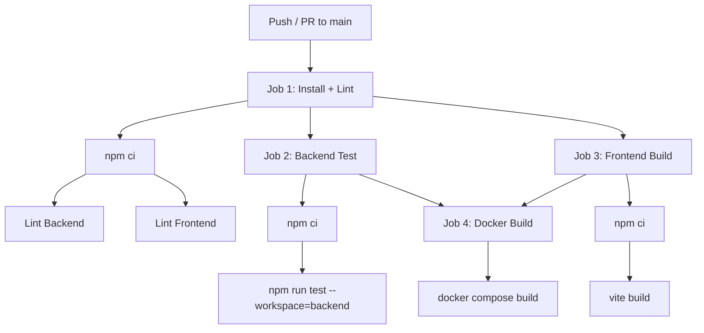

# 工程化升级说明

## 新增 / 修改文件清单

| 文件                                            | 类型 | 用途                                                                                                                                                                             |
| ----------------------------------------------- | ---- | -------------------------------------------------------------------------------------------------------------------------------------------------------------------------------- |
| `package.json`                                  | 新增 | Monorepo 根配置，npm workspaces 管理 backend + frontend，提供 lint/test/build 统一脚本，含 husky + lint-staged + prettier + eslint-plugin-prettier + eslint-config-prettier 依赖 |
| `eslint.config.mjs`                             | 新增 | 根目录共享 ESLint 9 flat config 基础规则 + Prettier 集成（eslint-plugin-prettier + eslint-config-prettier）                                                                      |
| `backend/eslint.config.mjs`                     | 新增 | 后端 ESLint 9 flat config，继承根目录基础规则，扩展 Node.js CommonJS 全局变量和 sourceType                                                                                       |
| `frontend/eslint.config.mjs`                    | 新增 | 前端 ESLint 9 flat config，继承根目录基础规则，扩展 Vue 3 插件 + 浏览器全局变量 + eslint-config-prettier 覆盖 Vue 格式规则                                                       |
| `.prettierrc`                                   | 新增 | Prettier 统一配置（tabWidth:2、singleQuote、trailingComma:all、printWidth:100）                                                                                                  |
| `.prettierignore`                               | 新增 | Prettier 忽略文件（node_modules、dist、package-lock.json 等）                                                                                                                    |
| `.husky/pre-commit`                             | 新增 | Git pre-commit 钩子，执行 lint-staged                                                                                                                                            |
| `.github/workflows/ci.yml`                      | 新增 | GitHub Actions CI Pipeline（Install+Lint → Backend Test / Frontend Build → Docker Build）                                                                                        |
| `backend/.env.example`                          | 新增 | 后端环境变量模板，列出所有必需变量及说明                                                                                                                                         |
| `README.md`                                     | 修改 | 补充本地开发环境配置说明、环境变量说明、常用脚本说明                                                                                                                             |
| `backend/package.json`                          | 修改 | 新增 lint/build/test 脚本，新增 eslint + @eslint/js devDependencies                                                                                                              |
| `frontend/package.json`                         | 修改 | 新增 lint/test 脚本，新增 eslint + @eslint/js + eslint-plugin-vue devDependencies                                                                                                |
| `backend/src/app.js`                            | 修改 | 修复 no-unused-vars lint 警告 + Prettier 格式化                                                                                                                                  |
| `backend/src/controllers/OrderController.js`    | 修改 | 移除未使用的 RoutePlannerService 导入，修复未使用的 type 解构变量 + Prettier 格式化                                                                                              |
| `backend/src/controllers/DeliveryController.js` | 修改 | 移除未使用的 signature 解构变量 + Prettier 格式化                                                                                                                                |
| `backend/src/**/*`                              | 修改 | 全部后端源码通过 Prettier 格式化（trailingComma、箭头函数参数括号等）                                                                                                            |
| `frontend/src/components/CardList.vue`          | 修改 | 修复 catch 变量未使用 lint 警告 + Prettier 格式化                                                                                                                                |
| `frontend/src/components/OrderList.vue`         | 修改 | 移除未使用的 computed 导入，修复 catch 变量未使用 lint 警告 + Prettier 格式化                                                                                                    |
| `frontend/src/store/index.js`                   | 修改 | 修复未使用的 greetingCard 参数 lint 警告 + Prettier 格式化                                                                                                                       |
| `frontend/src/views/*.vue`                      | 修改 | 移除未使用导入/变量，修复 lint 警告，全部通过 Prettier 格式化                                                                                                                    |

## ESLint + Prettier 集成方案

```
根目录 eslint.config.mjs
├── @eslint/js (recommended)
├── eslint-config-prettier (关闭与 Prettier 冲突的规则)
└── eslint-plugin-prettier (prettier/prettier 规则，ESLint --fix 自动格式化)

backend/eslint.config.mjs
└── 继承根配置 + Node.js CommonJS 环境

frontend/eslint.config.mjs
├── 继承根配置
├── eslint-plugin-vue (flat/recommended)
├── eslint-config-prettier (再次覆盖 Vue 格式规则，防止与 Prettier 冲突)
└── 关闭 vue/attributes-order 等与 Prettier 冲突的规则
```

### 关键设计

1. **Prettier 通过 ESLint 运行**：`eslint --fix` 自动调用 Prettier 格式化，lint-staged 不再需要单独跑 `prettier --write` 对 JS/VUE 文件
2. **eslint-config-prettier 双重覆盖**：根配置和前端配置各引入一次，确保 Vue 推荐配置中的格式规则被覆盖
3. **lint-staged 精简**：JS/VUE 文件只跑 `eslint --fix`（已包含 Prettier），JSON/MD/CSS/LESS 才单独跑 `prettier --write`

## lint-staged 配置

```json
{
  "backend/src/**/*.js": ["eslint --fix"],
  "frontend/src/**/*.{js,vue}": ["eslint --fix"],
  "*.{json,md,css,less}": ["prettier --write"]
}
```

## CI Pipeline 流程图



### Job 依赖关系

- **Job 1 (Install + Lint)**: 触发后立即执行，并行 lint 前后端
- **Job 2 (Backend Test)**: 依赖 Job 1 通过
- **Job 3 (Frontend Build)**: 依赖 Job 1 通过
- **Job 4 (Docker Build)**: 依赖 Job 2 和 Job 3 都通过
