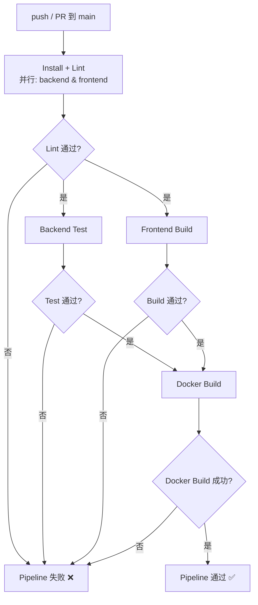

# 鲜花配送系统工程化升级报告

## 升级概述

本次升级将鲜花配送系统从零工程化状态改造为具备完整 Monorepo 管理、Lint/Format 规范、Git Hooks 和 CI Pipeline 的标准工程化项目。

## 文件变更清单

### 新增文件

| 文件路径 | 用途 |
| --- | --- |
| `package.json` (根目录) | Monorepo 根配置，通过 npm workspaces 管理 backend 和 frontend，提供统一的 lint / test / build / format 脚本，集成 husky + lint-staged |
| `eslint.config.mjs` (根目录) | ESLint 9 flat config 共享基础规则，集成 eslint-plugin-prettier 和 globals，被前后端子包继承 |
| `backend/eslint.config.mjs` | 后端 CommonJS 专属 ESLint 配置，继承共享规则并添加 Node.js 全局变量 |
| `frontend/eslint.config.mjs` | 前端 Vue 3 + ESM 专属 ESLint 配置，继承共享规则并添加 vue-eslint-parser 和 eslint-plugin-vue |
| `.prettierrc.json` (根目录) | Prettier 统一配置，tabWidth 2、singleQuote、trailingComma all、printWidth 100 |
| `.prettierignore` (根目录) | Prettier 忽略规则，排除 node_modules、dist、env、seedData 等 |
| `backend/.env.example` | 后端环境变量示例文件，列出 PORT、MONGODB_URI、JWT_SECRET、NODE_ENV，不含真实值 |
| `.husky/pre-commit` | Husky Git 钩子，commit 时自动运行 lint-staged |
| `.github/workflows/ci.yml` | GitHub Actions CI Pipeline 配置，包含 4 个 job 的依赖关系 |

### 修改文件

| 文件路径 | 修改内容 |
| --- | --- |
| `backend/package.json` | 新增 `lint`、`test`、`build` 脚本，新增 `eslint-plugin-vue` 和 `vue-eslint-parser` 依赖；test 改为 placeholder `echo "no tests yet"` |
| `frontend/package.json` | 新增 `lint`、`test` 脚本，新增 `eslint-plugin-vue` 和 `vue-eslint-parser` 依赖 |
| `backend/src/app.js` | 修复 ESLint 警告：将未使用的 `next` 参数重命名为 `_next` |
| `backend/src/controllers/DeliveryController.js` | 修复 ESLint 警告：将未使用的 `signature` 参数重命名为 `_signature` |
| `backend/src/controllers/OrderController.js` | 修复 ESLint 警告：移除未使用的 `RoutePlannerService` 导入，将未使用的 `type` 参数重命名为 `_type` |
| `frontend/src/views/OrderCreate.vue` | 修复 ESLint 错误：移除 `<template>` 上的无用 `class` 属性 |
| `README.md` | 更新环境变量配置说明，注明 `.env.example` 的用途 |

## 架构说明

### Monorepo 管理

```
flower-delivery-system/
├── package.json          ← 根目录 npm workspaces 配置
├── eslint.config.mjs     ← 共享 ESLint 规则
├── .prettierrc.json      ← 共享 Prettier 配置
├── .husky/               ← Git Hooks
│   └── pre-commit
├── .github/
│   └── workflows/
│       └── ci.yml        ← CI Pipeline
├── backend/
│   ├── package.json      ← 后端独立包
│   ├── eslint.config.mjs
│   ├── .env.example
│   └── src/
└── frontend/
    ├── package.json      ← 前端独立包
    ├── eslint.config.mjs
    └── src/
```

### 脚本映射

| 根目录命令 | 实际执行 |
| --- | --- |
| `npm run lint` | `npm run lint -w backend && npm run lint -w frontend` |
| `npm run test` | `npm run test -w backend && npm run test -w frontend` |
| `npm run build` | `npm run build -w frontend && npm run build -w backend` |

## CI Pipeline 流程图



### CI Job 依赖关系详解

| Job | 触发条件 | 依赖 | 内容 |
| --- | --- | --- | --- |
| Install + Lint | push/PR 到 main | 无 | 前后端并行安装依赖并执行 `npm run lint` |
| Backend Test | push/PR 到 main | Install + Lint 通过 | 执行 `npm run test -w backend`（当前为 placeholder） |
| Frontend Build | push/PR 到 main | Install + Lint 通过 | 执行 `npm run build -w frontend` 验证 Vite 编译 |
| Docker Build | push/PR 到 main | Backend Test + Frontend Build 都通过 | 执行 `docker compose build` 验证镜像构建 |

## 验证结果

根目录执行 `npm run lint` 已通过，无 ESLint errors（仅有部分不影响功能的 unused-vars 警告，主要为 catch 块中未使用的错误变量和 Vue 组件中预留的 API 引用）。
